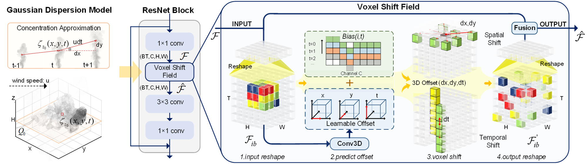

# Gaseous Object Detection (TPAMI 2024)


<p align="center">
   <a href='https://arxiv.org/pdf/2502.12415v1'>
      
   </a>
  
  
</p>

Abstract: Object detection, a fundamental and challenging problem in computer vision, has experienced rapid development due to the effectiveness of deep learning. The current objects to be detected are mostly rigid solid substances with apparent and distinct visual characteristics. In this paper, we endeavor on a scarcely explored task named Gaseous Object Detection (GOD), which is undertaken to explore whether the object detection techniques can be extended from solid substances to gaseous substances. Nevertheless, the gas exhibits significantly different visual characteristics: 1) saliency deficiency, 2) arbitrary and ever-changing shapes, 3) lack of distinct boundaries. To facilitate the study on this challenging task, we construct a GOD-Video dataset comprising 600 videos (141,017 frames) that cover various attributes with multiple types of gases. A comprehensive benchmark is established based on this dataset, allowing for a rigorous evaluation of frame-level and video-level detectors. Deduced from the Gaussian dispersion model, the physics-inspired Voxel Shift Field (VSF) is designed to model geometric irregularities and ever-changing shapes in potential 3D space. By integrating VSF into Faster RCNN, the VSF RCNN serves as a simple but strong baseline for gaseous object detection. Our work aims to attract further research into this valuable albeit challenging area.


<div align="center" style="width:image width px;">
  
</div>


## Usage


### 1.Installation

```bash
#Step 1. Create a conda environment and activate it.
conda create --name openmmlab python=3.8 -y
conda activate openmmlab

#Step 2. Install PyTorch following official instructions, e.g.
conda install pytorch torchvision -c pytorch

#Step 3. MMDetection Installation
#Install MMCV using MIM.
pip install -U openmim
mim install mmcv-full
#Install MMDetection
cd VSF-RCNN
pip install -v -e .    

# Step 4. install Shift3D
cd external/Shift3D
bash make.sh        
```
Please refer to the [mmdetection official guidence](https://github.com/open-mmlab/mmdetection/blob/2.x/docs/en/get_started.md/#Installation) for more details.

### 2.Dataset

You can preview the GOD-Video Dataset with [NJU Box](https://box.nju.edu.cn/d/654f74926166482fa569/) and download it from [dataset pages](https://calayzhou.github.io/2022/05/04/Dataset/). 

```bash
|-VSF-RCNN
|---TLGDM
|---DEMO
|---data
|---|---IOD-Video_COCO_S1 
|---|---IOD-Video_COCO_S2
|---|---IOD-Video_COCO_S3
```

### 3.Visualization
```bash
#Please refer to /mmdet/apis/test.py for more details
python tools/test.py  configs/faster_rcnn/faster_rcnn_r50_fpn_1x_coco_GOD-Video_VSF_demo.py  ./work_dirs_VSFv2/S2model.pth     --show-dir Visualization_Specifical
```

### 4.Evaluation
Step1: Download [work_dirs_VSFv2](https://drive.google.com/drive/folders/1Hn4dpNf4GSBxfvtBnMnLUvwCzbXilfA8?usp=drive_link) to `VSF-RCNN/work_dirs_VSFv2`.

Step2: Choose Split: change `data_root` and `ann_file` in `configs/_base_/datasets/GODVideo_detection.py`
```bash
# 4.1.Evalution with mmdetection (notice the split consistency between code and model)
python tools/test.py  configs/faster_rcnn/faster_rcnn_r50_fpn_1x_coco_GOD-Video_VSF.py   ./work_dirs_VSFv2/S1model.pth     --eval bbox

# 4.2.CVPR2022 version evalution pipeline
# 4.2.1 generate pkl file for evalution
python tools/test.py  configs/faster_rcnn/faster_rcnn_r50_fpn_1x_coco_GOD-Video_VSF.py ./work_dirs_VSFv2/S1model.pth    --show-dir show-dir

# 4.2.2 Calculate mAP with CVPR2022 evalution pipeline
cd ACT
bash ACT_run.sh 8 1 # 8-> frame number 1-> split
```

### 5.Train
```bash
# train on single GPU
python tools/train.py configs/faster_rcnn/faster_rcnn_r50_fpn_1x_coco_GOD-Video_VSF.py  --auto-scale-lr
# train on multi-GPUs
CUDA_VISIBLE_DEVICES=2,3 bash ./tools/dist_train.sh  configs/faster_rcnn/faster_rcnn_r50_fpn_1x_coco_GOD-Video_VSF.py  2
```

### 6.Results
| Split&Models    | mAP    |
|-----------------|--------|
| [S1model.pth](https://drive.google.com/file/d/19QiDA3TwMWm2gEvDmcPNm6e7j4B6oFw0/view?usp=drive_link) | 21.82% |
| [S2model.pth](https://drive.google.com/file/d/18WMlKEut1gl-lsZyR2qhZ43l0ZlaXzeW/view?usp=drive_link) | 17.22% |
| [S3model.pth](https://drive.google.com/file/d/1rXEYwuIqqEievcgj4xfYuEIxNU-ylAjQ/view?usp=drive_link) | 22.24% |
| Average         | 20.43% |


## LICENSE

- Code: [MIT LICENSE](./LICENSE)
- Dataset: GOD-Video dataset is licensed under <a href="https://creativecommons.org/licenses/by-nc-sa/4.0/?ref=chooser-v1" target="_blank" rel="license noopener noreferrer" style="display:inline-block;">Creative Commons Attribution-NonCommercial-ShareAlike 4.0 International</a></p>


## Citation
```
@article{zhou2024gaseous,
  title={Gaseous object detection},
  author={Zhou, Kailai and Wang, Yibo and Lv, Tao and Shen, Qiu and Cao, Xun},
  journal={IEEE Transactions on Pattern Analysis and Machine Intelligence},
  year={2024},
  publisher={IEEE}
}
```

